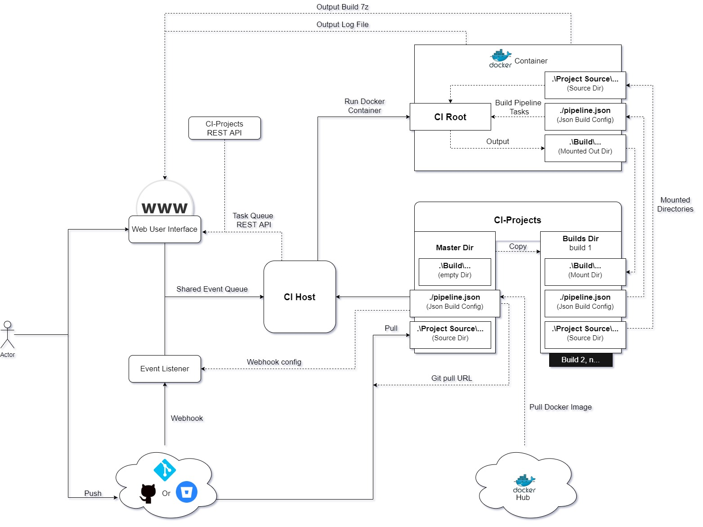

# AMS-Build 
###### AMS - *Automation Made Simple* 

## Overview
AMS-Build is a simple lightweight automation tool writen in python.
It has been designed to run and automate tasks in docker containers and
deliver the results to a clean and simple to use, web user interface.

AMS-Build has capabilities to accept webhooks from BitBucket and GitHub,
along with manual triggers via the web user interface.

AMS-Build runs on Ubuntu 18+ (with very limited support for windows)

## Contents
  1. [System Requirements and Dependencies](#1-System-Requirements-and-Dependencies)
  2. [Modules and Components](#2-Modules-and-Components)
  3. [How The Automation/Build Task work](#3-How-The-AutomationBuild-Task-work)
  4. [Getting Started](#4-Getting-Started)
  5. [Adding and Updating users](#5-Adding-and-Updating-Users)
  6. [Using The Web User Interface](#6.-Using-The-Web-User-Interface)
  7. [More Documents](#7-More-Documents)
    
## 1. System Requirements and Dependencies 

### Requirements 

###### **Minimal system requirements:**  
- 1 core
- 1GB memory  
###### **Recommended system requirements:**  
- 2 core
- 4GB memory  

### Dependencies  
| Product        | Version |
| :------------: | :-----: |
| Ubuntu (64bit) | 18+     |
| Python         | 3.7     |
| PyCryptodome   | 3.9.8   |
| Git            | [version here] |
| Docker         | [version here] |

## 2. Modules and Components
AMS-Build is made up of several components, across 3 key areas.
1. CI-Host
2. CI-Project
3. CI-Container (or CI-root)

#### CI-Host
CI-Host is the main module that handles automation tasks which is made up
of 3 components in itself.

The main component is the ```Main Ci Host``` which is heart of the system 
and houses the other 2 components, (1) ```Web User Interface``` and
(2) ```Git Events/Webhooks```.

Both the ```Web User Interface``` and ```Git Events/Webhooks``` use a shared 
queue from ```Main Ci Host```, to queue tasks such as Start/Build, 
Stop/Cancel and delete output/build data (todo) ect, from there respected locations.

The ```Main Ci Host``` is then responsible for processing said task accordingly.
Some tasks are executed immediately once received by the main ci host while
others (build tasks) are moved to a 'pending tasks' list, until there is an
available slot in the 'active tasks' list.

**Current Available Tasks include,**
```
- Build task,       # the main task type, handles updating project, 
                    # setting up output folders and handling docker 
                    # containers. 
                    # Build tasks are queued until a build slot is available.
                    
- Cancel task       # If task is pending, removes it from the queue,
                    # Otherwise stops the docker container.
                    # Cancel tasks are executed immediately once received 
                    # by the main ci host.
                    
- Delete output     # Deletes all of a tasks output (TODO, not implemented)
                    # Delete are executed immediately once received 
                    # by the main ci host.
```
##### - Web User Interface
The Web User Interface is the main portal, that allows users to view, create 
and cancel any tasks, along with view project outputs, status and other basic
info, also not forget access to the 7z's of the builds. 

Users must login to the Web User Interface and can only access / preform 
operations on project that they have permission to (and only up to there access level) 

For more info on user types and accounts see, 
- **User Types and Access Levels** 
- **Adding A New User**

##### - Git Events/Webhooks
The Git Events receives a webhook from either GitHub or BitBucket, when an 
event such as PUSH is trigger on the GIT server. When the event is received 
by AMS-Build, a build task is created and queued if the git trigger actor is 
an approved actor in the target project webhook config.

For further info on Webhook Actors and access level see,
- **User Types and Access Levels** 
- **Approving webhook actors**

#### CI-Project
Ci-Project directory contains all projects available to AMS-Build.
Each project must contain a 'master' directory for the master copy of the project
and a 'builds' directory for each triggered build. 

The master directory must contain an empty folder for the output build, the 
project source directory, and the config directory along with an empty txt file
for the std-output.

Finally there must be pipeline.json file in the config directory.

The root of each project also contains auto generated files for basic project 
and build info.

For more info on the CI-Projects structure and overview of pipeline files see, 
- **./CI-projects/README.md**
- **./CI-project/pipelineJSON.md**

For more info on auto generated files see,
- **./CI-projects/exampleProject/projectBuildInfoJSON.md**
- **./CI-projects/exampleProject/projectInfoJSON.md**

Also see, (in this readme)
- **Getting started**, for info on setting up a project. 

#### CI-Container (CI-root)
CI-Container, is a simple piece of python that is launched inside the container 
to setup any environment variables set in the Pipeline.json file followed by
running each stage of the defined pipeline. 

Each stage runs in a new environment.

## 3. How The Automation/Build Task work

  
[fig 1. System overview]  

When a build task is first triggered and accepted, the ```"prepare-build"```
sections of the projects pipeline.json file is ran.

First it runs the ```master-dir-commands``` inside of the master source directory
(```CI-Project/{project_name}/master/project_source```)  

Followed by copying the master directory into the builds folder also renaming 
the folder to build name

Once the project has been copied, the ```build-dir-commands``` are ran inside
of the copied project source
(```CI-Project/{project_name}/builds/{build_name}/project_source```)

And the task is finally queued for execution.

```
Note.
I decided to update and copy the master directory, to ensure that project
is not modified before or during execution. 
So that the project remains the exact state that it was at trigger time.
```

When the ```Main Ci Host``` receives a build task (on the shared queue),

It first put the task into the ```pending task``` list where it waits for
an available task execution slot in the ```active task``` list.

```
Side Note.
When there are no pending task, the main thread waits for a task to arrive on 
the shared queue. (the queue blocks the thread)
If there are pending tasks the main thread ticks over once every second to monitor
task thread statuses (ie task alive?). Also collects new tasks as they arrive.

The reason for this is to ensure that the queues does not block us from, 
from promoting queue tasks to active tasks. But this no longer the case
as we have methods to unblock the queue when a task is completed.
So this may change in the near future. :)  
```
Once an available task slot becomes available, the task is moved from the 
```pending``` list to the ```active``` list, followed by starting a new 
task worker (thread) with the task passed in and the task is executed.

When the task is executed its starts by pulling the docker image if once 
does not exist locally. Once the docker image has been obtained, the docker
run command is built using the ```docker``` section of the projects pipeline,
and the container is run.

The docker container is configure as follows.
```
# Container name 
'{project_name}{build_hash}'

# Container args 
Are defined in the 'docker' section of the pipeline file.

# Mounted Directories
'.../{build_name}/project_source' -> 'docker.project-dest' defined in pipeline
'.../{build_name}/build'          -> 'docker.build-output-dest' defined in pipeline
'.../{build_name}/config'         -> root directory of the container as a READ-ONLY directory
'/CI-Root'                        -> root directory of the container as a READ-ONLY directory

# Image
Defined in the 'docker' sections of the pipeline file.

# command
python3 {path_to_ci_root}/main-ci-root.py

Note.
Root needs to be added to the 'docker' section of pipeline.
Currently its located in ```const.py``` and it applies to all projects (my bad)
```
Once all pipeline task has completed, the status is determined and the project 
clean up begins 
```
Note. ATM the system is not suitable for multiple pipeline task, due to the single build directory.
Also Note. Build Status is yet to be implemented, I seem to of forgot about this :/
```

When the clean up begins, it first 7Zips the build folder (also removing it), 
followed by generating the 7z hash, if configured to do so in the 'clean-up'
section of the pipeline file.

```
Note. Builds can only be downloaded from the Web User Interface if they are 7z-ed.
```

7z hash types available
- **null**      (do not hash)
- **CRC32**
- **CRC64**
- **SHA1**
- **SHA256**
- **BLAKE2ep**
```
Note. that 7z is used to generate the hash.
```

And the project source is remove, if also configured to do so in the 'clean-up'
section of the pipeline file.

Once the clean up has finished the outbound webhooks are triggered if defined in
the ```webhooks.json``` config file and a ```TASK-COMPLETE``` message is put onto the 
shared queue, to ensure it is unblocked and able to update the task list 
(queue and active)

- See **Webhooks** for more info on outbound webhooks.

###### Project Build Statuses

| Status | Discription          | Note              |
| :----- |:-------------------- | :---------------- |
| PASS   | Build was successful | |
| FAIL   | Build failed         | Not Implemented   |
| CANCEL | Build was canceled   | |
| SKIP   | Build was skipped    | Not Implemented   |
| DUMMY  | Dummy fake build     | |


## 4. Getting Started

Before running AMS-Build for the first time, you need to run ```./ams-build-setup.sh```
to install python requirements, set the AMS-Build root directory and add an alias
to to run AMS-Build.

To run './ams-build-setup.sh' on Ubuntu 
``` 
sudo chmod u=rwx ams-build-setup.sh
./ams-build-setup.sh
``` 

Now we can run AMS-Build by typing command ```amsbuild```

When the application is run for the first time you will be presented with a
username (admin) and password (???) in the console logs. This is the default 
account used for the web user interface and has restricted access for testing.

see 'Adding a user' for more info on creating accounts for projects.

As it stands, there is no way to setup a project via the ```Web User Interface```
and must all be done backend via the OS.

### Setting up a project 
1. start by making a copy of the ```blankProject``` directory
in ```CI-project```, renaming the directory to your projectName.
```(ie. `.../CI-project/blankProject` -> .../CI-project/MyNewProjectExample)```

2. Navigate to ```.../MyNewProjectExample/master/project_source``` and add your
project source from git. Making sure that git is at the root of the directory.
The easiest way to achieve this would be to remove the example
```project_source``` folder, clone the git repo and rename the folder to
```project_source```

3. Now we need to add the pipeline config to the project_source. Navigate to 
```CI-projects/blank_project/master/project_source``` and copy ```pipeline.json```
to your project_source folder and open it in your favorite IDE and update the file
to your projects automation config. (its recommended to sync the pipeline file with 
your git)

The pipeline contains 3 main sections that are required
```
1. docker            # The docker container config
2. prepare-build     # The commands that are required to prepare the source for building
3. pipeline          # The commands required for each stage in the pipeline
```
While the reset are optional
```
1. webhook           # webhook config
2. environment       # variables to be set in the environment
3. cleanup           # how the project should be cleaned up
```
See ```../Ci-project/PipelineJSON.md``` for a full description 
of each field in the file.

Once the pipeline is complete, the project is all set up.
See the next section (Accepting Webhooks), for information on setting the webhook,
to automate the build trigger.  
Also see 'Adding A User' section for information on setting up users for 
```Web User Interface``` and allowing access to projects.

### Webhooks

#### Accepting inbound webhooks
Webhooks are used to trigger a build when an event happens on a git server.  
AMS-Builds supports multiple webhooks per project.

To setup a webhook for a project goto the  ```webhooks.json``` file, 
under the webhook section, enter a name for your projects webhook and a list 
of the accepted git actor names.

Example 
```
...
"webhook": {
  "name": "MyWebhookName",
  "authorized-actors": [
      "git_actor_one",
      "git_actor_two",
      "git_actor_three"
    ]
}
...
```

now its just a case of setting the webhook address on the git server

```
Webhook Default Config,

Port            8081
root path       /request

Query String (GET)
    name        {webhook name}
    project     {project name}
    
POST data:
    data from github or BitBucket webhook
    
eg. mydomain.com:8081/request?name=example&project=example_project

```

You can update the webhooks default IP (0.0.0.0) and port (8081) by editing the
```webhook_ip``` and ```webhook_port``` in ```./CI-Host/data/configs/web_conf.json```.

Also see **Setting up SSL** for setting up SSL for webhooks and the web-interface 
And see ```CI-Project/webhookJSON.md``` for more info on the structure of inbound webhooks

#### Sending Outbound webhooks
Outbound webhooks are usful for automatically posting message to team messages 
services such as Slack or Discord when an event has occurred on the server.
Such as a build task has complete.

At the current time AMS-Build only has support Discord.  
and only support 
- standard content 
- username overrides
- embeds
  - with Fields
of the discord webhook API

See. [Discord Webhooks API](https://discord.com/developers/docs/resources/webhook#execute-webhook) for more info

AMS-Build has support for multiple outbound webhooks def that are all defined in the 
```webhooks.json``` project config file.

Each definition must contain 5 fields.
1. **hook-name** name of inbound webhook
2. **type** The type of webhook ie discord
3. **trigger** the trigger type of the hook. ie build-complete
4. **url** The address the webhook is targeting
5. **data** The webhooks payload.

The data field closely resembles the Discord webhook structure (but not quite exact)

See ```CI-Projects\webhookJSON.md``` for more info on outbound webhooks

## 5. Adding and Updating Users
##### New user
To add a new user run 'python3 user_manager.py' to enter the user manager 
standalone mode, where you will prompted to enter the users username, permission,
projects and define a file containing the users password. By default the password
file is ```CI-Host/data/new_user``` (but in the .gitignore to prevent accidental 
password commits)

Once the password has been successfully entered, it is over writen with '.' (dot)

##### Updating a users account
To Update a users password, run 'python3 user_manager.py' and enter an existing
username, where you be promoted for the file containing the users password 
(Default ```CI-Host/data/new_user```) The file must have the users current 
password on line 1 and the new password on line 2.

To update the users, username, permissions, or projects you must update the json 
file directly.

Example Json
```JSON
{
  "username": "User_0",
  "secret": "DO NOT CHANGE",
  "projects": ["project_1", "project_2", "project_n..."],
  "access_level": 3
}
```

**(Do NOT add new user directly to this file, use the user manager instead)**

##### User Types and Access Levels ( For Web User Interface and Webhooks )

| User Type    | Access Level | Permissions                                                  | Other Info                 |
| :----------- | :----------: | :----------------------------------------------------------- | :------------------------- |
| NO AUTH      | 0            | None. No Access                                              |                            |
| USER         | 1            | View/Download assigned projects                              |                            |
| WEBHOOK      | 2            | Only Triggers Build Tasks                                    | Available to Webhooks only |
| MODERATOR    | 3            | Same as USER + Trigger Tasks for assigned projects           |                            |
| ADMIN        | 4            | Same as MODERATOR + Add/Assigne users to assigned project    | TODO (Not implemented)     |
| SERVER ADMIN | 5            | All Permissions on All Projects                              | TODO (Not implemented)     |


## 6. Using The Web User Interface
The Web User Interface can be accessed by going to mydomain.com:8080/ams-ci/

```
Web User Interface Default Config,

Port            8080
root path       /ams-ci/

Default user    admin
Password        [On first run, AMS-build will present a password for testing, in the console]

path example. mydomain.com:8080/ams-ci/

```

You can update the webhooks default IP (0.0.0.0) and port (8080) by editing the
```web_interface_ip``` and ```web_interface_port``` in ```./CI-Host/data/configs/web_conf.json```.

Also see **Setting up SSL** for setting up SSL for the web-interface and webhooks

#### Interface
Before being able to access the web interface you must log in using user credentials.
Once logged in you will then be presented with the tasks and project areas.
```
|------------------------------|
| Message Panel                |
|------------------------------|
| Active | Projects            |
| Tasks  |---------------------|
|--------| Builds              |
| Queued |                     |
| Tasks  |                     |
|------------------------------|
```

All active and queued tasks can be seen by all users, but the user may only
preform an action on tasks that they have permission to access.

Projects - Lists all projects that the users has access too

Builds - List of all builds + output & download links along with statues.

User may only preform actions on tasks, up to there user access level.  
(its worth noting that the links are still displayed even without access
but the server will reject the request.)

For more info on user access levels see  
User Types and Access Levels ( For Web User Interface and Webhooks )

#### API
Before being able to access the web interface API you must log in using user credentials

```
Note.
At the movement CORS is disabled across the Web User Interface, with plans to allow
approved sites later on the API only.
```

APIs root directory is ```ams-ci/api/```

The api can be used to gain 'Active' and 'Queued' tasks, project and build info
as well as user info for the currently logged in user
##### API Examples.

###### Tasks

 **View all tasks**  
 ```ams-ci/api/tasks```
 
Example Output
```JSON
{
  "active": [
              {
                "task_name": "exampleProject_c9bffcd6309225d86d2ff455f454d8ab9ec538cb_build_1", 
                "task_hash": "c9bffcd6309225d86d2ff455f454d8ab9ec538cb", 
                "project": "exampleProject", 
                "created_by": "example_user", 
                "created_at": "19/08/2020 @ 01:50:05", 
                "started_at": -1
              }
             ],
  "pending": []
}
```
**View Active Tasks Only**  
```ams-ci/api/tasks/active```

**And Queued Tasks Only**  
```ams-ci/api/tasks/queued```

**To Show Only Active or Queued Task For A Single Project**  
```ams-ci/api/tasks/{action}/project/{project-name}```

**Show Only Active or Queued Tasks Created By Actor**  
```ams-ci/api/tasks/{action}/created_by/{actor}```

```
Note.
You can filter by any field defined in the json '{}', but only within a
single list (ie. '[]')
and it also possible to filter by more than one field

# Example Format
ams-ci/api/{api-group}/{list-name}/{json-field-1}/{json-field-1-value}/{json-field-2}/{json-field-2-value}
 
```

###### Projects

**List All Projects** (that the logged in user has access to)  
```ams-ci/api/projects```  

Example Output
```JSON
[
  {
    "name": "exampleProject",
     "base_path": ".../exampleProject"
  },
  {
    "name": "exampleProject-1",
     "base_path": ".../exampleProject-1"
  }
]
```

**List All Project Data**
```ams-ci/api/projects/name/{project-name}```

Example Output (for ```ams-ci/api/projects/name/exampleProject```)
```JSON
{
    "name": "exampleProject",
    "base_path": ".../exampleProject", 
    "project_info": {
          "ProjectName": "exampleProject", 
          "latest_build_index": 24, 
          "latest_build_key": "exampleProject_26d1805d4f069feda85067b6315c3106e7d2de59_build_1", 
          "last_created_time": 1597801805.508211, 
          "last_execute_time": 1597186667.3346303, 
          "last_complete_time": 1597186635.6530728
      },
    "builds": [
          {
              "name": "exampleProject_26d1805d4f069feda85067b6315c3106e7d2de59_build_1",
               "hash": "26d1805d4f069feda85067b6315c3106e7d2de59", 
               "git_hash": "c965346a7e4eeae786f58e4a79dd298e61762825", 
               "build_id": 1, 
               "status": "pass", 
               "created_by": "example user",
               "created_at": "12/08/2020 @ 03:32:00", 
               "canceled_by": null, 
               "canceled_at": null, 
               "7z_link": "dl/exampleProject/exampleProject_26d1805d4f069feda85067b6315c3106e7d2de59_build_1", 
               "7z_hash": "88E73A4983B8BC1CDFF3079411F2607B1CE87592", 
               "output_log": "output/exampleProject/exampleProject_26d1805d4f069feda85067b6315c3106e7d2de59_build_1"
           }
        ], 
    "tasks": {
              "active": [],
              "pending": []
          }
}

```

**Project Info Only**  
```ams-ci/api/projects/name/{project-name}/project_info```

**Project Builds**  
```ams-ci/api/projects/name/{project-name}/builds```

**Project Active and Queued Tasks**  
```ams-ci/api/projects/name/{project-name}/tasks```

The same filtering as 'Tasks' applies here too. so   
**To to display all passed tasks**  
```ams-ci/api/projects/name/{project-name}/builds/status/pass```

Or **Display all failed tasks by an actor**  
```ams-ci/api/projects/name/{project-name}/build/created_by/example user/status/fail```

### A Bit About Security
As with any private task or automation server, its recommended to host it on 
a private network so it can be accessed internally or via a vpn or proxy.

But this is not always possible especially if using GitHub or (public) BitBucket 
webhooks.
In this case it is recommended to setup a firewall on the webhook port (default 8081)
to only allow connection for trusted git servers.
```
GitHub IPs      : (link)
BitBucket IPs   : (link)
```
And to only allow connects via vpn to the web interface (default port 8080).

##### Setting up SSL for the ```Web User Interface``` and ```Webhooks```. (its real simple)
Its also recommended to setup SSL, you can gain a free 90 day SSL certificate, from a
number of providers such as [Lets Encrypt](https://letsencrypt.org/) or [Zero SSL](https://zerossl.com/)
(among others). There's also scripts to automatically renew the certificate every 60-90 days 
[acme.sh](https://github.com/acmesh-official/acme.sh).

Once you have gained your certificates set ```use_ssl``` to ```true``` and update 
the SSL file paths in ```./CI-Host/data/configs/web_conf.json```  
Example
```JSON
"user_ssl": true,
"ssl":{
    "cert_file": "path/to/my/certificate.crt",
    "ca_bundle_file": "path/to/my/ca_bundle.crt",
    "private_file": "path/to/root/access/only/private.key"
}
```
The ```cert_file``` and ```ca_bundle_file``` are both considered public so you
can just kinda plonk them anywhere, while the ```private_file``` is considered 
(you guessed it) private and therefore should be stored somewhere with only root
access 

Reset AMS-Build and you good to go :D

## 7. More Documents
[CI-Project Directory Structure](./CI-projects/README.md)  
[Build Pipeline Config](./CI-projects/pipelineJSON.md)  
[Webhooks Config](./CI-projects/webhooksJSON.md)
[Build Dir (Note)](./CI-projects/exampleProject/builds/README.md)

###### Generated Files  
[Tasks (Active and Queue) Json Information](./CI-Host/data/tasksJSON.md)  
[Project Info](./CI-projects/exampleProject/projectInfoJSON.md)  
[Project Build Info](./CI-projects/exampleProject/projectBuildInfoJSON.md)

###### Other
[TODO](./TODO.md)  
[Change Log](./changeLog.md)
